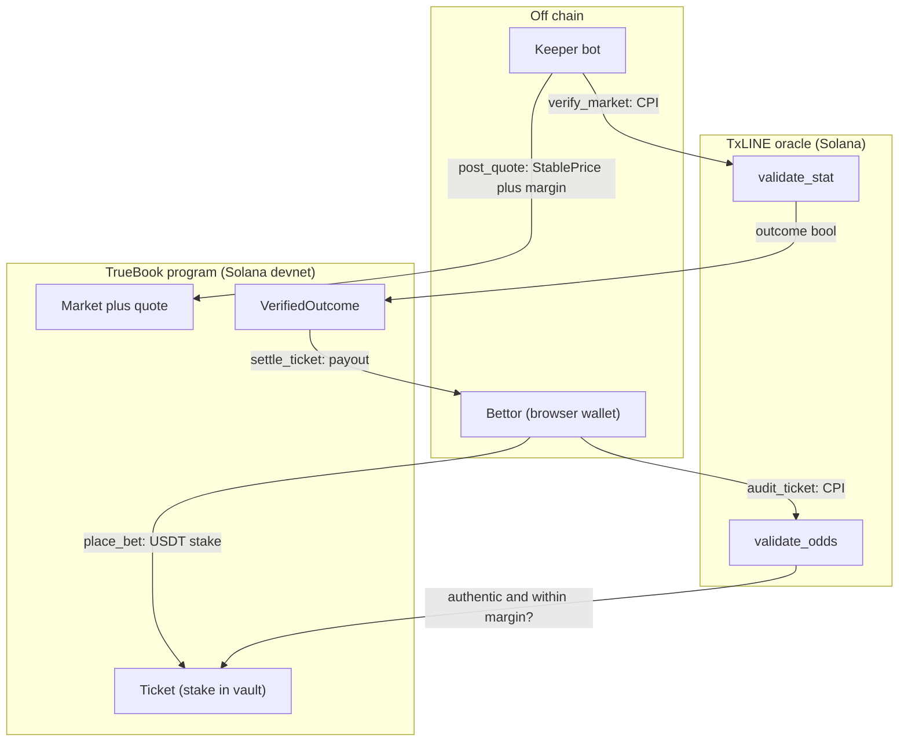

<p align="center"></p>

<h1 align="center">TrueBook</h1>

<p align="center">
A provably-fair sports book on Solana devnet. Every price it serves is a public
TxLINE consensus price plus a shown margin, auditable on chain after the bet.
Outcomes settle from cryptographic score proofs by cross-program call into the
TxLINE oracle, not a trusted server. A proven overcharge refunds the bettor,
even on a losing ticket.
</p>

<p align="center">Built for the TxODDS World Cup hackathon (Superteam Earn), Prediction Markets and Settlement track.</p>

<p align="center">
<a href="https://truebook-app.vercel.app"></a>


</p>

<p align="center"><b>Live devnet app: <a href="https://truebook-app.vercel.app">truebook-app.vercel.app</a></b></p>

<!--
  HERO AND STATE SCREENSHOTS (add before final submission, per readme-craft).
  They cannot be captured from the current headless session, so they are left
  out rather than faked. To add them:
  Run the app in chain mode (NEXT_PUBLIC_DATA_SOURCE=chain), connect a wallet,
  and capture at 1280 to 1600 px wide, default dark theme, no browser chrome,
  PNG under 500 KB each, into docs/screenshots/:
    01-lobby.png     home: honesty banner with real vault and open markets
    02-match.png     /match: the price-transparency popover (consensus vs served)
    03-tickets.png   /tickets: a settled receipt next to a PROVEN OVERCHARGE stamp
    04-verify.png    /verify: the on-chain verified outcome
  Then embed 01 as the hero here, and put 02 to 04 in a two-column table.
-->

## 🎯 The problem

Every sportsbook, centralized or on chain, sets its own prices, and no bettor can
check them. You are told the odds are fair; you cannot prove they were. The usual
on-chain fix resolves the winner through a trusted oracle or an optimistic dispute
game, which decides the outcome but says nothing about the price you were quoted
when you placed the bet.

TxLINE closes both gaps. It anchors a global odds consensus on Solana (a new
merkle root roughly every five minutes) and anchors match statistics the same way.
TrueBook uses both halves: the score anchor settles each market from a proof
instead of a trusted call, and the odds anchor makes every price the house served
auditable after the fact. The house is held honest by code, not by trust.

## 🧭 What it does

- **Priced from consensus.** `post_quote` sources each market's price from the
  `TXLineStablePriceDemargined` feed, adds a fixed shown margin, and records the
  source odds `MessageId` and timestamp on the market.
- **Bets snapshot their provenance.** `place_bet` moves the stake into the house
  vault and copies the served odds and their source record into the `Ticket`, so
  the exact quote a bettor took is on chain. Bettors sign it from a browser wallet.
- **Trustless settlement.** `verify_market` cross-program calls the TxLINE
  `validate_stat` instruction, reads the boolean outcome from return data, and
  writes it to a `VerifiedOutcome` account. The submitted proof is bound to the
  market's committed predicate, so a keeper cannot resolve a different question.
- **Provable price audit, paid.** `audit_ticket` cross-program calls
  `validate_odds` to authenticate the odds record a ticket references, then
  compares the served implied probability against consensus plus the stated
  margin. A proven overcharge sets the ticket refundable, even a losing one, and
  even if the house already settled it to Lost first; the first prover earns 5%
  of the stake from the vault's free liquidity.
- **Provable cash-out.** `cash_out_ticket` buys a live ticket back at a price
  derived on chain from the current quote (payout weighted by the opposite
  side's implied complement) and records the quote's provenance in a
  `CashOutReceipt`; `audit_cash_out` proves a lowball the same way an opening
  price is proven, and `claim_cash_out_repair` repays the shortfall.
- **Portable proof receipts.** Any ticket exports a JSON receipt (quote proofs,
  outcome proof, every transaction signature) that
  `keeper verify-receipt <file>` re-proves against devnet with no TxLINE token
  and no keypair. Two committed under [docs/receipts/](docs/receipts/).
- **Permissionless cranks.** `lock_market`, `verify_market`, `settle_ticket`,
  `refund_ticket`, and the audits can be called by anyone; the outcome and the
  math are on chain, not in an operator's discretion.

## 🏗 How it works



The diagram shows the happy path. The program also handles the rest: a served
quote expires after 120 seconds, so a bet cannot be placed against a stale price.
Every bet checks the vault covers its potential payout and a per-market exposure
cap before it is accepted. A market whose outcome cannot be proven within 48 hours
of kickoff can be voided by anyone, and its tickets refunded in full. A ticket the
price audit flags as an overcharge becomes refundable regardless of the result,
and if the house front-runs the audit by settling the losing ticket first, the
audit still flips it to refundable and the stake is returned exactly once.

### 🔬 Markets are TxLINE predicates

A market is a binary YES or NO question expressed in the native language of
`validate_stat`: `stat_a [op stat_b] comparison threshold`, over a period. The
program stores that predicate and binds every settlement proof to it.

| Market | Predicate | Period |
| --- | --- | --- |
| Home win | goals(P1) minus goals(P2) greater than 0 | Total |
| Draw | goals(P1) minus goals(P2) equal to 0 | Total |
| Over 2.5 goals | goals(P1) plus goals(P2) greater than 2 | Total |
| Home wins by 2+ | goals(P1) minus goals(P2) greater than 1 | Total |
| Over 0.5 first-half goals | goals(P1) plus goals(P2) greater than 0 | 1st half |

`stat` keys and periods come straight from the TxLINE score encoding (key 1 is
Participant1 goals, key 2 is Participant2 goals, period 0 is Total). A 1X2 board
is three of these binary markets. The devnet keeper lists this full pre-match
catalog per fixture (seven markets: the 1X2 trio, two totals lines, a first-half
line, and a winning-margin line) plus short-window in-play totals lines over the
live score during matches. `create_market` refuses any predicate that maps to no
TxLINE consensus record, because such a market could never be priced or audited
honestly (corners markets are absent for exactly that reason).

## 🔗 Live on devnet

The program is deployed and the app is running against it. Everything below is
public on-chain state on Solana devnet.

| Artifact | Address or URL | Explorer |
| --- | --- | --- |
| App | https://truebook-app.vercel.app | [open](https://truebook-app.vercel.app) |
| TrueBook program | `59txn6d3rHFtvhocB5ZvhhJsTurGNq1d1gcbDy7o43fh` | [view](https://explorer.solana.com/address/59txn6d3rHFtvhocB5ZvhhJsTurGNq1d1gcbDy7o43fh?cluster=devnet) |
| Test USDT mint | `ELWTKspHKCnCfCiCiqYw1EDH77k8VCP74dK9qytG2Ujh` | [view](https://explorer.solana.com/address/ELWTKspHKCnCfCiCiqYw1EDH77k8VCP74dK9qytG2Ujh?cluster=devnet) |
| TxLINE oracle (settlement source) | `6pW64gN1s2uqjHkn1unFeEjAwJkPGHoppGvS715wyP2J` | [view](https://explorer.solana.com/address/6pW64gN1s2uqjHkn1unFeEjAwJkPGHoppGvS715wyP2J?cluster=devnet) |

Try it in two minutes, no setup:

1. Open [truebook-app.vercel.app](https://truebook-app.vercel.app) and click
   **Judge mode**. Connect a Solana wallet (Phantom, Solflare, Backpack), then
   request devnet SOL and test USDT. Both go to your own wallet on devnet.
2. Open a match and place a bet. The price-transparency popover shows the TxLINE
   consensus price, the served price, and the margin between them, side by side.
   Sign the bet in your wallet.
3. Open **Tickets**, click **Audit & earn 5%** on a ticket. Your wallet submits
   the `validate_odds` proof; an overcharge is stamped PROVEN OVERCHARGE on
   chain, the ticket becomes refundable, and the audit pays you 5% of its stake.

Evidence:

- **The house is quoted from consensus, live.** The keeper reads every market's
  price from the live `TXLineStablePriceDemargined` feed and posts it on chain;
  the app reads the house vault and open markets straight from the program.
- **It can catch itself lying.** One market is kept deliberately overpriced. Bet
  the bad price, lose, and audit it: `validate_odds` proves the served price
  exceeded consensus plus the margin, and the losing ticket is refunded on chain.
  We made our own book lie, and the chain caught it.
- **The program can say no.** `verify_market` rejects a proof whose stats,
  operator, comparison, or threshold do not match the market's committed predicate
  (`PredicateMismatch`), so a keeper cannot settle a different question than
  bettors were quoted. This is asserted in the test suite.
- **Receipts outlive us.** Re-verify the committed sting receipt against devnet
  yourself, with no TxLINE account and no wallet:

  ```bash
  cd keeper && bun run src/index.ts verify-receipt ../docs/receipts/sting.json
  ```

  Success is the last line printing `[verifyReceipt] PASS` (it re-derives the
  merkle root accounts, re-runs `validate_odds` and `validate_stat` as free
  simulations, and checks every referenced transaction exists).

Deeper reading: [docs/TECHNICAL_OVERVIEW.md](docs/TECHNICAL_OVERVIEW.md) (trust
model, instruction map, audit math),
[docs/TXLINE_API_FEEDBACK.md](docs/TXLINE_API_FEEDBACK.md) (eight verified
integration frictions), and
[docs/SECURITY_AUDIT_2026-07-14.md](docs/SECURITY_AUDIT_2026-07-14.md).

## 🧪 Reproduce it

Prerequisites: [Bun](https://bun.sh) 1.3 or newer, Rust via
[rustup](https://rustup.rs), the Solana CLI (Agave 4.0.2 or newer), and
[Anchor](https://www.anchor-lang.com) 0.31.1. The `program/Cargo.lock` pins seven
crates so the default Solana platform-tools (Rust 1.79) can build the program; do
not `cargo update` them (see [docs/TOOLCHAIN_NOTES.md](docs/TOOLCHAIN_NOTES.md)).

```bash
git clone https://github.com/Andy00L/truebook
cd truebook
bun install
cd program
anchor test
```

Success looks like the suite printing `9 passing`. `anchor test` starts a local
validator that clones the live TxLINE oracle program, its program data, and two
daily merkle roots from devnet, deploys TrueBook, then runs the full flow:
initialize the house, fund the vault, create a home-win market, quote it, place a
YES bet, lock, `verify_market` by CPI, settle the winner, audit the served price,
refund a losing ticket that was settled before its audit, cash a live ticket out
at the on-chain price and audit it honest, and repay a lowballed cash-out with
the auditor's bounty. It writes nothing to devnet.

Evidence the system can say no, not only yes:

- `verify_market` rejects a proof whose stats, operator, comparison, or threshold
  do not match the market's committed predicate (`PredicateMismatch`).
- `audit_ticket` sets a ticket refundable when the served implied probability
  exceeds consensus plus the stated margin, proven against the anchored odds root,
  and does so even after the house settles that ticket to Lost.

To run the surface yourself: `cd app && bun run dev` starts the frontend, and
`cd keeper && bun run src/index.ts list` prints the live house and every market
from devnet. The keeper commands are `setup`, `fund`, `list`, `tick`, `serve`,
`settle`, `rig`, `bet`, `cashout`, `audit`, `audit-cashout`, `refund`,
`export-receipt`, and `verify-receipt`.

## ⚠️ What is real and what is simplified

- **The program is deployed and test-proven.** Fifteen instructions,
  `anchor test` green (nine cases) against the real TxLINE oracle cloned from
  devnet, and the program is live at
  `59txn6d3rHFtvhocB5ZvhhJsTurGNq1d1gcbDy7o43fh` on devnet.
- **The frontend is built and deployed.** Lobby, match with the price-transparency
  popover, tickets with proof receipts, a public verify page, and a replay view,
  live at the URL above. Screenshots are not embedded in this README yet; the live
  app is the proof, and the capture list is noted in the source for a later pass.
- **The keeper is run live on devnet.** It authenticates to TxLINE, creates
  markets, quotes them from the live odds feed, locks them at kickoff, and its
  `serve` loop re-quotes and auto-settles finished fixtures. It is operator-run
  around match windows, not a hosted always-on service. Settlement runs by CPI
  as proven in the suite; each market settles from a score proof as its match
  finishes.
- **Betting uses a test SPL mint.** On devnet the book uses the TxLINE test USDT
  mint (`ELWTK...G2Ujh`, six decimals); the integration test uses a local mint it
  controls. No real funds, no KYC.
- **The live catalog is goals-only.** The keeper lists the seven-market
  pre-match catalog from the table above per fixture, plus in-play totals
  windows. Every predicate is a goals pair, because those are the questions the
  devnet feed publishes both a consensus price and a provable stat for; corners
  or cards markets would be unpriceable and unauditable, so `create_market`
  refuses them.
- **The NO-side consensus is the demargined complement.** For a binary market the
  NO implied probability is derived as one minus the YES implied probability. A
  multi-way board would carry an explicit price index per outcome.
- **The authority holds a void lever.** The house authority can void an Open or
  Locked market before its outcome is anchored, refunding every stake, which
  exists for unresolvable fixtures but could also be used to dodge a losing
  book. The counterweight is that `verify_market` is permissionless: anyone can
  anchor the outcome first, and a Verified market can no longer be voided.
- **Vault solvency is conservative.** The vault must cover the full potential
  payout of every live ticket at once, with no netting of opposite sides. It is a
  safe over-collateralization, and simpler to audit than a netted book.

## 📚 Prior art and related work

- **Polymarket**: a central-limit order book resolved by the UMA optimistic
  oracle, whose resolutions have been publicly disputed. TrueBook resolves from a
  cryptographic score proof and additionally audits the served price, not only the
  outcome. [polymarket.com](https://polymarket.com)
- **Azuro and Overtime (Thales)**: pooled-liquidity and AMM sportsbooks. They
  price and settle, but do not expose a per-ticket price audit against an anchored
  consensus. [azuro.org](https://azuro.org), [overtimemarkets.xyz](https://overtimemarkets.xyz)
- **BetDEX and the Monaco Protocol**: an on-chain betting exchange on Solana, a
  peer-to-peer order book rather than a house that proves its own prices.
  [monacoprotocol.xyz](https://www.monacoprotocol.xyz)

## 📦 Repository layout

```
program/          Anchor program: house, markets, tickets, CPI settlement, price audit, cash-out
app/              Next.js (App Router) frontend, live on devnet
keeper/           TypeScript bot: auth, markets, quotes, settle, audits, receipts
packages/shared/  TxLINE client (auth, SSE, proofs), shared types, receipt schema, IDLs
docs/             technical overview, API feedback, security audit, receipts, research
```

## 📜 License

MIT. See [LICENSE](LICENSE).
