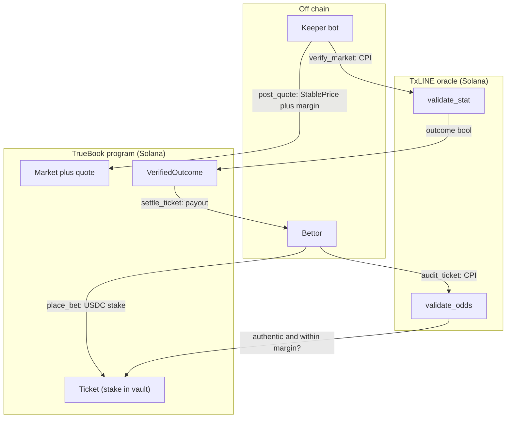

<p align="center"></p>

<h1 align="center">TrueBook</h1>

<p align="center">
A provably-fair sports book on Solana devnet: every price it serves is a public
TxLINE consensus price plus a displayed margin, auditable on chain after the fact.
Outcomes settle from cryptographic score proofs by cross-program call into the
TxLINE oracle, not a trusted server. A proven overcharge refunds the bettor, even
on a losing ticket.
</p>

<p align="center">Built for the TxODDS World Cup hackathon (Superteam Earn), Prediction Markets and Settlement track.</p>

<p align="center">


</p>

The interface is under construction, so this README documents the backend, which
is complete and test-proven. The architecture is below, and `anchor test`
reproduces the full trustless flow (bet, verify, settle, audit) in one command
against the real TxLINE oracle.

## 🎯 The problem

Every sportsbook, centralized or on chain, sets its own prices, and no bettor can
check them. You are told the odds are fair; you cannot prove they were. The usual
on-chain fix resolves the winner through a trusted oracle or an optimistic dispute
game, which decides the outcome but says nothing about the price you were quoted
when you placed the bet.

TxLINE closes both gaps. It anchors a global odds consensus on Solana (a new
merkle root roughly every five minutes) and anchors match statistics the same way.
TrueBook uses both halves: the score anchor settles each market from a proof
instead of a trusted call, and the odds anchor makes every price the house served
auditable after the fact. The house is held honest by code, not by trust.

## 🧭 What it does

- **Priced from consensus.** `post_quote` sources each market's price from the
  `TXLineStablePriceDemargined` feed, adds a fixed displayed margin, and records
  the source odds `MessageId` and timestamp on the market.
- **Bets snapshot their provenance.** `place_bet` moves the stake into the house
  vault and copies the served odds and their source record into the `Ticket`, so
  the exact quote a bettor took is on chain.
- **Trustless settlement.** `verify_market` cross-program calls the TxLINE
  `validate_stat` instruction, reads the boolean outcome from return data, and
  writes it to a `VerifiedOutcome` account. The submitted proof is bound to the
  market's committed predicate, so a keeper cannot resolve a different question.
- **Provable price audit.** `audit_ticket` cross-program calls `validate_odds` to
  authenticate the odds record a ticket references, then compares the served
  implied probability against consensus plus the stated margin. A proven overcharge
  sets the ticket refundable, even a losing one.
- **Permissionless cranks.** `lock_market`, `settle_ticket`, `void_market`, and
  `refund_ticket` can be called by anyone; the outcome and the math are on chain,
  not in an operator's discretion.

## 🏗 How it works



The diagram shows the happy path. The program also handles the rest: a served
quote expires after 120 seconds, so a bet cannot be placed against a stale price.
Every bet checks the vault covers its potential payout and a per-market exposure
cap before it is accepted. A market whose outcome cannot be proven within 48 hours
of kickoff can be voided by anyone, and its tickets refunded in full. A ticket the
price audit flags as an overcharge becomes refundable regardless of the result.

### 🔬 Markets are TxLINE predicates

A market is a binary YES or NO question expressed in the native language of
`validate_stat`: `stat_a [op stat_b] comparison threshold`, over a period. The
program stores that predicate and binds every settlement proof to it.

| Market | Predicate | Period |
| --- | --- | --- |
| Home win | goals(P1) minus goals(P2) greater than 0 | Total |
| Draw | goals(P1) minus goals(P2) equal to 0 | Total |
| Over 2.5 goals | goals(P1) plus goals(P2) greater than 2 | Total |
| Second-half corners over 4.5 | corners(P1) plus corners(P2) greater than 4 | 2nd half |

`stat` keys and periods come straight from the TxLINE score encoding (key 1 is
Participant1 goals, key 2 is Participant2 goals, period 0 is Total). A 1X2 board is
three of these binary markets.

## 🧪 Reproduce it

Prerequisites: [Bun](https://bun.sh) 1.3 or newer, Rust via
[rustup](https://rustup.rs), the Solana CLI (Agave 4.0.2 or newer), and
[Anchor](https://www.anchor-lang.com) 0.31.1. The `program/Cargo.lock` pins seven
crates so the default Solana platform-tools (Rust 1.79) can build the program; do
not `cargo update` them (see [docs/TOOLCHAIN_NOTES.md](docs/TOOLCHAIN_NOTES.md)).

```bash
git clone https://github.com/Andy00L/truebook
cd truebook
bun install
cd program
anchor test
```

Success looks like the suite printing `6 passing`. `anchor test` starts a local
validator that clones the live TxLINE oracle program, its program data, and two
daily merkle roots from devnet, deploys TrueBook, then runs the full flow:
initialize the house, fund the vault, create a home-win market, quote it, place a
YES bet, lock, `verify_market` by CPI, settle the winner, and audit the served
price. It writes nothing to devnet.

Evidence the system can say no, not only yes:

- `verify_market` rejects a proof whose stats, operator, comparison, or threshold
  do not match the market's committed predicate (`PredicateMismatch`), so a keeper
  cannot settle a different question than bettors were quoted.
- `audit_ticket` sets a ticket refundable when the served implied probability
  exceeds consensus plus the stated margin, proven against the anchored odds root.

## ⚠️ What is real and what is mocked

- **The backend is complete and test-proven.** Twelve instructions, `anchor test`
  green (six cases), exercised against the real TxLINE oracle cloned from devnet.
- **The frontend is not built yet.** There are no screenshots to show. The UI
  (lobby, price transparency, proof receipts, a public verify page, replay) is the
  next milestone.
- **The keeper is built and typechecked, not yet run live.** It compiles, and its
  on-chain calls are the same ones the integration test drives; the live TxLINE
  API run (auth, fixtures, quotes) is still pending.
- **Not deployed to devnet.** The program id `59txn6d3rHFtvhocB5ZvhhJsTurGNq1d1gcbDy7o43fh`
  is reserved; the test runs on a local validator against cloned real oracle state.
- **Betting uses a test SPL mint.** On devnet the book uses the TxLINE test USDT
  mint; the integration test uses a local mint it controls. No real funds.
- **The NO-side consensus is the demargined complement.** For a binary market the
  NO implied probability is derived as one minus the YES implied probability. A
  multi-way board would carry an explicit price index per outcome.
- **Vault solvency is conservative.** The vault must cover the full potential
  payout of every live ticket at once, with no netting of opposite sides. It is a
  safe over-collateralization, and simpler to audit than a netted book.

## 🔗 Prior art and related work

- **Polymarket**: a central-limit order book resolved by the UMA optimistic
  oracle, whose resolutions have been publicly disputed. TrueBook resolves from a
  cryptographic score proof and additionally audits the served price, not only the
  outcome. [polymarket.com](https://polymarket.com)
- **Azuro and Overtime (Thales)**: pooled-liquidity and AMM sportsbooks. They
  price and settle, but do not expose a per-ticket price audit against an anchored
  consensus. [azuro.org](https://azuro.org), [overtimemarkets.xyz](https://overtimemarkets.xyz)
- **BetDEX and the Monaco Protocol**: an on-chain betting exchange on Solana, a
  peer-to-peer order book rather than a house that proves its own prices.
  [monacoprotocol.xyz](https://www.monacoprotocol.xyz)

## 📦 Repository layout

```
program/          Anchor program: house, markets, tickets, CPI settlement and price audit
app/              Next.js (App Router) frontend, in progress
keeper/           TypeScript bot: auth, create markets, quote, lock, verify, settle
packages/shared/  TxLINE client (auth, SSE, proofs), shared types, program IDLs
docs/             build plan, research, spike findings, toolchain notes
```

## 📜 License

No license file yet. Add one before submission; MIT is the usual choice for a
hackathon entry.
